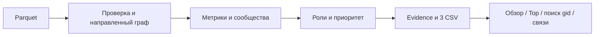

# Money Graph — план на 5 часов

Статус: **только план; реализация ожидает подтверждения пользователя**. Актуальный кейс — «Граф денег», не Career Quest. Команда: два технических участника и один Product / QA / Demo. Время ниже отсчитывается от начала согласованной реализации.

## 1. What winning the task actually requires

Ответить AML-аналитику: «Кого проверить первым и почему?» Сценарий: обзор сети → Top 20 → поиск любого `gid` → направленные связи → роль, приоритет и конкретные факты → выгрузка. Выводы — признаки и гипотезы для проверки, не доказательство виновности.

Обязательны: воспроизводимый локальный pipeline менее 300 секунд, три CSV, роль и кластер каждого узла, интерфейс, README, схема решения, пятиминутное демо. Жюри должно суметь назвать любые три `gid`, а команда — показать и объяснить их по рассчитанным метрикам за минуту. Главная сложность — отделить наблюдаемый паттерн от неполноты выборки и убедительно разрешить пересечение ролей.

### Проверено в репозитории

- `starter/README.md`, `starter/starter.py`, `starter/requirements.txt` прочитаны. После упрощения структуры их содержимое не изменилось. Starter загружает parquet, считает степени, суммы, количества транзакций, PageRank, отношение потоков; записывает пустые роли/кластеры/Top. Это заготовка, не готовый результат.
- Starter добавляет в граф только концы рёбер; его `sanity_check` проверяет совпадение пар, но не равенство сумм/количеств. План: дополнить, а не переписывать рабочую загрузку.
- Реальные файлы находятся непосредственно в **`data/`**. Прочитан официальный **`data/README.md`**, полученный вместе с ТЗ: он является основным описанием схемы и параметров сбора; фактические parquet с ним согласуются. Starter находится непосредственно в `starter/`.
- Чтением parquet подтверждены 2248 уникальных узлов, 3119 уникальных направленных пар, 4840 транзакций, 81 seed; NULL, неизвестных концов рёбер и самопереводов нет.
- `nodes`: `gid:int64, depth:int64, is_seed:bool`; `edges`: `src:int64, dst:int64, sum_kzt:float64, n_tx:int64, depth:int8`; `transactions`: `src:int64, dst:int64, date:object, sum_kzt:float64`. Даты успешно разбираются: 1–31 июля 2026, точность — день. Минимальная транзакция 5000 KZT.
- По официальному README `nodes.depth` — минимальное колено первого появления (0–4, 0 = seed), а `edges.depth` — колено обнаружения ребра (1–4), не глубина получателя. На текущих данных подтверждены `is_seed == (nodes.depth == 0)` и `edges.depth == nodes[src].depth + 1`. `date` семантически является датой без времени, хотя pandas читает колонку как object; loader должен явно разобрать её. Транзакции — отдельные переводы по найденным рёбрам, не полная история счетов.
- Агрегаты транзакций совпадают с рёбрами по всем парам и количествам; максимальная разница сумм около `5.8e-11` KZT — погрешность float. **97 совпадающих строк транзакций сохраняем**: без transaction ID нельзя считать их ошибочными дублями.
- 444 узла depth=4 без исходящих; ещё 1091 получатель без исходящих находится на depth<4. На графе с рёбрами 16 слабых компонент; **с 19 изолированными seed — 35 компонент**. Все 2248 клиентов должны сохраниться.
- Корневой README пока краткий. `src/data.py`, `src/engine.py`, `requirements.txt`, `.gitignore` — ранее созданные непроверенные черновики, а не подтверждённая реализация. `app.py`, запуска полного pipeline, проверенных CSV пока нет. В существующем окружении отсутствует SciPy, необходимый используемому пути PageRank.
- `PLAN.md` — единственный артефакт текущего этапа; исходники, данные и starter не изменяем. Существующие наработки сохраняем, дальнейшее переиспользование — после проверки A.

## 2. MUST / SCORE / OPTIONAL matrix — Requirements

Обозначения: A = Technical Lane A, B = Technical Lane B, P = Product / QA / Demo Lane. Владелец отвечает за сдачу, QA может проверять чужую поставку. «План» означает отсутствие подтверждённого результата.

| Класс / требование | Проверка | Планируемое доказательство | Владелец | Статус |
|---|---|---|---|---|
| MUST: parquet → 3 CSV одной командой, <300с | Чистый и повторный запуск | `pipeline.py`, журнал времени, хеши | A | План; данные проверены |
| MUST: 2248 ролей, evidence ≤200, оценки [0,1] | Независимый validator | `outputs/nodes_roles.csv`, отчёт проверок | A | План |
| MUST: 6 формальных ролей, объяснение любого gid | Правила + ручная проверка трёх случайных узлов | `src/engine.py`, карточка, README | A | Есть непроверенный черновик |
| MUST: кластер каждого узла и сводка | Покрытие, суммы, seed, изоляты | `outputs/clusters.csv` | A | План |
| MUST: Top ≥20 с why | Ранги, уникальность, пересчёт приоритета | `outputs/top_nodes.csv` | A | План |
| MUST: граф, направление, роли/кластеры, поиск и связи | Произвольный gid, фильтры, вход/выход | `app.py`, QA-протокол | B | План |
| MUST: ограничения выборки влияют на расчёт | depth=4, seed, изоляты, порог 5k | Признаки наблюдаемости, тесты, evidence | A | Требует проверки черновика |
| MUST: локально, без hardcoded gid/атрибутов/облака | Чистый запуск, ревью зависимостей | Исходники, закреплённые зависимости | B | План |
| MUST: исходники, README, диаграмма, 5-минутное демо | Проход по инструкции другим участником | README, `docs/architecture.md`, `docs/demo.md` | P | План |
| SCORE: независимые тесты и повторяемость | Граничные случаи и повторный прогон | `tests/`, `validate.py`, QA-отчёт | B | План |
| SCORE: понятность, роль ≠ приоритет, раскрытие вкладов | Пользователь объясняет выбранный узел | Карточка с метриками и score breakdown | B | План |
| SCORE: методология, масштаб ~1M, осторожный AML-язык | Проверка соответствия работающему коду | README, вопросы жюри | P | План |
| OPTIONAL: временное подтверждение транзита | Проверка дневного FIFO-сопоставления | Дополнительный temporal-признак | A | Кандидат после P0 |
| OPTIONAL: устойчивость Top к весам приоритета | Сравнение Top 20 при небольших изменениях весов | Короткий диагностический отчёт | A | Кандидат после P0 |

Обработка depth=4 обязательна, несмотря на её повторное упоминание среди optional в задании. LLM, циклы, аномалии, синхронность и удаление Top-N сейчас вне объёма.

## 3. Proposed methodology

### Признаки и нормализация

Сохранить понятные имена starter: `in_deg, out_deg, in_kzt, out_kzt, in_tx, out_tx, pagerank, pass_through, depth, is_seed`. Добавить `component_id`, `cluster_id`, `at_boundary`, `truncated_by_depth`, `ratio_usable`, betweenness, межкластерные связи, расстояние до seed, оценки ролей и вклады приоритета.

- Степени — разные контрагенты; суммы и `n_tx` — отдельные признаки. Средний размер перевода показывать в карточке при ненулевом количестве, не превращать его в самостоятельную модель.
- Взвешенный PageRank; направленный **невзвешенный** betweenness с `k=min(128,N)` и фиксированным seed. Сумма перевода не является расстоянием. Значения по компонентам показывать в контексте размера компоненты.
- Расстояние от ближайшего seed по исходящим рёбрам; отдельное состояние «недостижим». Межкластерный показатель — доля соседей вне своего кластера × нормализованное число таких соседей.
- Нормализация `N(x)=clip(log1p(x)/Q95(log1p(x)>0),0,1)`; при отсутствии положительных значений — ноль. Распределения и знаменатели сохранять в метаданных, не пересчитывать при фильтре UI.
- Для нулевого входа `pass_through` не определён: в диагностике nullable + `ratio_usable=false`, а не фиктивный ноль. Все обязательные CSV-поля остаются заполненными. Для seed и boundary отношение исключается из role scoring.

**Пороги выводим из данных, а не из известных gid.** Наблюдаемые Q75 положительных значений: in-degree=1, out-degree=3, входящий объём=166819.7 KZT. Минимум два контрагента — смысл fan-in/fan-out, не статистическая подгонка. Поэтому кандидатные degree-пороги: `max(2,ceil(Q75_positive))`. Для значимого входа terminal — Q75 положительного объёма. Эти числа вычисляются при запуске; не вставляются литералами в алгоритм. Пороги centrality выводятся из положительных значений после их расчёта в H1.

### Роли

`I/O` — нормализованные степени, `V_in/V_out` — объёмы, `T_in/T_out` — количества переводов, `B/P` — betweenness/PageRank. `fan_in=in_deg/(in_deg+out_deg)`, `fan_out=1-fan_in`, для изолята оба 0. Все score в [0,1]. Веса ниже — открытая стартовая эвристика, не обученная вероятность; фиксируем версию после H2, проверив чувствительность и контрпримеры.

| Роль | Допуск и scoring | Оговорка / объяснимость |
|---|---|---|
| consolidator | in-degree ≥ своего degree-порога; `0.40I + 0.25V_in + 0.15T_in + 0.20fan_in` | Сходящиеся потоки, а не доказательство накопленного остатка; не использовать неполный баланс seed |
| distributor | out-degree ≥ своего degree-порога; `0.40O + 0.25V_out + 0.15T_out + 0.20fan_out` | Число получателей, оборот и количество переводов видимы напрямую |
| transit | Есть вход/выход, не seed, depth<4; `balance=min(r,1/r)` для r>0; balance ≥ Q75 среди пригодных кандидатов; `0.45balance + 0.35min(V_in,V_out) + 0.20min(T_in,T_out)` | В P0 лишь сходство наблюдаемого входа/выхода; не утверждать, что деньги не задерживаются |
| terminal | depth<4, in-degree>0, out-degree=0, вход ≥ Q75 положительных входов; `0.50V_in + 0.25I + 0.25T_in` | «Наблюдаемый конечный получатель». Для boundary score=0 независимо от объёма |
| coordinator | Есть вход/выход; B ≥ Q75 положительного B и B>0; дополнительно ≥2 соседей в других кластерах **или** минимум 2 отправителя и 2 получателя; `0.45B + 0.20P + 0.20bridge + 0.15min(I,O)` | Совместное свидетельство посредничества и соединения ветвей, не просто максимальный PageRank |
| peripheral | Нет допустимой содержательной роли | «Недостаточно выраженного паттерна в доступной выборке», не «безопасный клиент» |

Если положительных значений для порога нет, соответствующая роль не допускается. Все пять содержательных оценок считаются отдельно; для недопущенной роли итоговая оценка 0 и сохраняется причина недопуска. Победитель — максимальный score; при точном равенстве использовать документированный порядок словаря ролей. Сохранять вторую роль и разрыв, чтобы видеть пересечение гипотез. Не вводить квоты на число клиентов каждой роли.

**role_score:** индекс поддержки выбранной гипотезы, не вероятность истинной роли. Пусть s1/s2 — две лучшие допустимые оценки: `role_score=s1×(1−0.5×s2)`. Пересечение сильных ролей снижает уверенность; базовые оценки и margin остаются доступны. Для peripheral поддержка определяется как `1−max(допустимые score)` и относится только к отсутствию наблюдаемого паттерна. У boundary/изолята итоговую уверенность ограничить сверху 0.5: неполнота данных не должна создавать высокую уверенность. Значение 0.5 — явно задокументированный консервативный предел, а не эмпирическая вероятность; проверить его влияние в H2.

### Приоритет проверки — отдельная формула

`priority_score = 0.35×structure + 0.20×seed_proximity + 0.30×magnitude + 0.15×role_support`.

- `structure = 0.60B + 0.25P + 0.15bridge`.
- `seed_proximity=1/(1+d)`, для недостижимого 0; seed сам по себе не доказывает значимую роль.
- `magnitude=N(in_kzt+out_kzt)` — наблюдаемый оборот, не баланс.
- `role_support` — выбранный role_score; для peripheral компонент 0.

Все компоненты и взвешенные вклады сохранять. Приоритет не равен role_score; высокий оборот даёт максимум 0.30. Проверить, не превращается ли итоговый Top в сортировку только по объёму, включая влияние коррелирующего PageRank. Веса — продуктовая эвристика порядка проверки, не оценка виновности. При равных приоритетах сортировать по числовому gid.

### Кластеры и evidence

Louvain отдельно внутри каждой слабой компоненты на неориентированной weighted projection: вес пары — сумма обоих направлений. Исходный граф сохранить направленным. Изолят — отдельное сообщество. Фиксировать random seed, порядок узлов/рёбер и назначение cluster_id по размеру сообщества и минимальному gid. Кластеры не могут объединять несвязанные компоненты.

Для clusters.csv внутренний оборот — сумма направленных исходных рёбер, у которых оба конца в кластере, каждый перевод учитывается один раз. Top gids — до 5 по priority. Hypothesis строится из размера, seed, доминирующих ролей, внутренних потоков и доли boundary; не придумывать бизнес-назначение.

Evidence — русские шаблоны, 2–3 фактических числа, плюс существенное ограничение. Пример формы: «Получает от {in_deg} контрагентов; вход {in_kzt} KZT, выход {out_kzt} KZT. Граница depth=4: продолжение неизвестно». Для transit не писать «быстро», пока нет temporal-проверки. Для coordinator показать betweenness, ветвление/межкластерные связи; why для Top добавляет два главных вклада приоритета. Лимит 200 символов обеспечивать сокращением основного текста, **не обрезанием caveat**. Карточка раскрывает исходные значения, порог и альтернативную роль.

## 4. Data-quality handling

| Ограничение | Последствие в реализации и проверке |
|---|---|
| depth=4 | `at_boundary=depth==4`; `truncated_by_depth=at_boundary and out_deg==0` как у starter; запрет terminal для всей boundary; снижение уверенности; текст в evidence/UI |
| Неполный вход seed | Seed исключён из ratio-driven transit; consolidator основан на реально видимых отправителях; отношение не используется для «аномальности» |
| Только исходящий обход | Никаких полных балансов/«удержанных денег»; все суммы помечены как наблюдаемые, transit — гипотеза |
| Порог 5000 | Проверить минимум; UI/README показывают порог; не вычислять признаки дробления ниже порога |
| Несвязность | Добавить nodes до рёбер; 16 компонент с рёбрами +19 изолятов; сохранить всех seed; фильтр компоненты |
| Нет ground truth | Тесты свойств и контрпримеров, аудит распределений; не заявлять accuracy/F1 |
| Дневные даты | Temporal только «тот же/следующие 2 календарных дня»; порядок внутри дня неизвестен; нельзя обещать точность 48 часов |
| Float, повторы | Сверка сумм с `rtol=1e-9, atol=0.01`, количеств точно; 97 совпадающих строк не удалять |
| Схема официального README | Проверить nodes.depth в 0–4, edges.depth в 1–4, seed↔depth=0, даты за июль 2026; не подменять колено обнаружения ребра глубиной dst. Согласованность edge depth с src проверять как отдельную диагностику текущего набора |

Ошибки схемы/ID/дат/нечисловых сумм прекращают запуск с именем файла, поля и краткой причиной. Не затирать последнюю успешную выгрузку при неуспехе: сначала staging, затем валидация, manifest завершённого запуска публикуется последним.

## 5. Minimal vertical slice — Smallest complete solution

К **T+60 минутам**: реальные parquet → граф со всеми узлами → базовые признаки + Louvain → первая версия шести правил и приоритета → три заполненных CSV → простая Streamlit-страница Top/поиск/карточка/направленный ego-граф.

Это рабочий первый проход, не заявление о финальном качестве. До T+120 — аудит score/ограничений и обязательных полей. Нельзя считать вертикальный срез готовым, если UI работает только на mock, отсутствуют изоляты или CSV заполнены placeholders.

## 6. Architecture

Один Python-проект: pandas/PyArrow + NetworkX для batch-анализа, Streamlit + Plotly для локального UI. БД, backend API, auth, микросервисы и LLM не нужны. UI читает результаты завершённого запуска, расчёт не повторяется при каждом клике.

Предлагаемые файлы: `pipeline.py`; существующие `src/data.py`, `src/engine.py`; новые `src/reporting.py`, `src/contracts.py`, `src/view.py`; `app.py`, `validate.py`, `tests/`; `outputs/`. Переиспользовать загрузку и базовые формулы starter с исправлением покрытия узлов и проверок; не вести два независимых pipeline. Starter сохранить как исходный reference.

Ожидаемые команды после документированной установки закреплённых зависимостей:

- `python pipeline.py --data data --out outputs` — весь обязательный pipeline.
- `python validate.py --data data --out outputs` — независимая проверка.
- `streamlit run app.py -- --outputs outputs` — интерфейс.

Это **планируемые интерфейсы**, сейчас команд ещё нет. B проверяет чистое окружение, включая SciPy; пакетный расчёт после установки работает без сети. Установка зависимостей не входит в runtime анализа, это явно указать.

Поток данных для будущей диаграммы `docs/architecture.md`:

UI: sidebar с поиском gid, role/cluster/component/priority; центр — overview сообществ и ego-network 1–2 шага; справа — метрики, роль, score, priority breakdown, caveats. Цвет переключается роль/кластер, стрелки обозначают поток. Обзор включает все компоненты в агрегированном виде. Ego ограничить 100 узлами с явным счётчиком скрытых; полные входящие/исходящие связи доступны таблицами. Точный поиск gid работает независимо от активных фильтров и явно сообщает об их обходе.

## 7. Shared contracts

**Контракт A v1.0.0 зафиксирован в `src/contracts.py`.** Модуль содержит декларативные схемы, порядок ролей, веса, допуски и структуру manifest; импортируется без pandas/NetworkX. Это спецификация обмена, не реализация pipeline или независимого валидатора. B ещё должен подтвердить чтение fixture, P — соответствие ТЗ. У каждого контракта ниже один технический владелец — **A**; потребители — B (validator/UI) и P (acceptance). Изменения только через явную передачу версии, без параллельного редактирования.

| Контракт | Формат / поля | Проверка |
|---|---|---|
| Node metrics | `gid:int64`, depth, is_seed; метрики starter; component/cluster; boundary/ratio flags; betweenness, bridge, seed distance; 6 scores, alternative/margin; 4 priority components | Одна строка на gid; nullable только документированные ненаблюдаемые признаки; finite остальные значения |
| Role result | `gid, role, role_score, evidence` | Ровно шесть допустимых ролей; score [0,1]; evidence 1..200 Unicode-символов |
| Priority result | `gid, priority_score`, отдельные компоненты и вклады; `why` для Top | Итог равен сумме вкладов; порядок по score desc, gid asc |
| Cluster result | `cluster_id:int, n_nodes:int, n_seed:int, sum_kzt_internal:float, top_gids:string, hypothesis:string` | Покрытие всех узлов; seed≤size; top_gids через `|`, принадлежат кластеру |
| `nodes_roles.csv` | `gid,role,role_score,cluster_id,priority_score,evidence` | Ровно 2248 строк, точное множество входных gid |
| `clusters.csv` | Поля Cluster result | Непустой; суммы сверены с edges |
| `top_nodes.csv` | `rank,gid,role,priority_score,why` | ≥20 уникальных gid, rank от 1; согласован с nodes_roles |
| UI bundle | Три CSV + `node_metrics.parquet`, `edges.parquet` с исходной схемой + `run.json` | UI не объединяет артефакты разных запусков; нет скрытого доступа к пути input |
| `run.json` | schema_version, input/output SHA256, node/edge/tx counts, versions, seed, thresholds, stage runtimes, role distribution, warnings | Публикуется после успешного validator; хеши подтверждают целостность |

CSV: UTF-8, заголовок, без pandas index, decimal point, корректное quoting. Gid в хранении — исходный int64; в UI/Plotly передавать строкой, чтобы не терять точность и не получать `.0`. Пример evidence задаётся шаблоном с полями, не выдуманным реальным gid. B создаёт отдельно помеченный synthetic fixture для проверки чтения, A подтверждает его соответствие контракту.

Ошибка bundle: UI показывает «Нет завершённого расчёта / несовместимая версия» и команду запуска, не рисует случайные старые данные. Неизвестный gid — понятное сообщение, без исключения приложения.

### Contract v1.0.0 — правила реализации и передачи B

**Авторитет схем.** Точные обязательные имена, порядок колонок, типы и nullable находятся в `OUTPUT_SCHEMAS` модуля `src/contracts.py`. Таблица выше — краткое описание. Обязательные поля идут первыми; дополнительные колонки допускаются после них, B их игнорирует. Отсутствующее поле, неправильный тип, NULL вне разрешённых мест или неизвестная версия — ошибка. В v1 потребитель принимает только точное `SCHEMA_VERSION`; расширения обязательного контракта требуют новой согласованной версии. Python — 3.10+ для импорта типов этого модуля.

**Идентификаторы и сериализация.** `gid/src/dst` сохраняются как исходные signed int64, без преобразования через float. CSV читаются с явно заданными типами: `dtype={"gid": "int64"}` для nodes/top; `top_gids` — строка. Для Plotly/JSON-интерфейса ID преобразуются в десятичные строки. Все сравнения и tie-break выполняются численно. `nodes_roles.csv` и `node_metrics.parquet` отсортированы по gid asc; Top — priority desc, gid asc; clusters — cluster_id asc; edges — src asc, dst asc. CSV: UTF-8 без BOM, LF, точка как десятичный разделитель, без index; числа не округлять для отображения перед экспортом. Форматирование интерфейса не изменяет хранимые значения.

**Связность и кластеры.** `component_id` и `cluster_id` — целые от 0 без пропусков. Компоненты и сообщества нумеруются по убыванию размера, затем по минимальному числовому gid; сообщества нумеруются глобально. Каждый узел принадлежит ровно одной компоненте и одному кластеру; кластер не пересекает компоненты, изолят получает отдельные component/cluster. `top_gids` содержит от 1 до min(5,n_nodes) уникальных десятичных gid через `|`, в порядке priority desc/gid asc. Внутренняя сумма считается по направленным исходным рёбрам один раз. Набор edges в bundle сохраняет входные строки и исходную схему; нельзя молча отбрасывать петли или менять веса.

**Метрики.** Имена степеней, сумм и количеств: `in_deg/out_deg`, `in_kzt/out_kzt`, `in_tx/out_tx`. Все неотрицательны; counts и degrees — целые. `pass_through=out_kzt/in_kzt`, NULL ровно при in_kzt=0. `at_boundary=(depth==4)`; `truncated_by_depth=at_boundary and out_deg==0`; `ratio_usable=(in_kzt>0 and not is_seed and not at_boundary)`. Для seed с положительным входом отношение можно хранить, но нельзя использовать в ratio-driven scoring. `seed_distance` — целое число исходящих шагов от ближайшего seed, 0 для seed, NULL для недостижимого; не -1. `cross_cluster_degree` считает уникальных соседей вне кластера независимо от направления, `bridge_fraction` делит их число на число всех уникальных соседей (0 для изолята), `bridge=bridge_fraction×N(cross_cluster_degree)`. PageRank и betweenness неотрицательны; bridge и нормированные компоненты лежат в [0,1].

**Роли и неоднозначность.** `ROLES` задаёт vocabulary и порядок разрешения точного равенства: consolidator, distributor, transit, terminal, coordinator, peripheral. Для каждой содержательной роли сохраняются `eligible_<role>`, `score_<role>` и `ineligible_reason_<role>`. Причина — непустая строка, если допуск false, иначе NULL; при false оценка строго 0. Формулы и gates — раздел 3. Если нет допустимых содержательных ролей, выбрать peripheral; `score_peripheral=1`, иначе 0. Peripheral не конкурирует с содержательными ролями. При содержательной роли s1/s2 — две лучшие допустимые оценки; если второй нет, s2=0. `alternative_role` — вторая допустимая роль либо NULL, `alternative_score=s2`, `role_margin=s1-s2`; для peripheral alternative=NULL, alternative_score=0, role_margin=0. `role_score=s1×(1−0.5×s2)`; для peripheral до ограничения 1. Для boundary или изолята итоговый role_score ограничен 0.5. Все шесть score и role_score в [0,1], это не вероятности.

**Приоритет.** Поля `priority_structure`, `priority_seed_proximity`, `priority_magnitude`, `priority_role_support` содержат невзвешенные компоненты из раздела 3, каждая в [0,1]. `priority_role_support=0` для peripheral, иначе role_score. `contribution_<component>=PRIORITY_WEIGHTS[component]×priority_<component>`; priority_score равен сумме четырёх вкладов с абсолютным допуском `SCORE_ATOL=1e-12`, без temporal-компонента. Сортировка использует сохранённые значения без предварительного округления. Top — первые K строк полной сортировки, K≥20 на официальном наборе, ранги 1..K без пропусков. Поля общих узлов в metrics/nodes/top совпадают; why содержит два крупнейших вклада, при равенстве используется порядок PRIORITY_WEIGHTS.

**Текст.** Все обязательные строковые поля непустые; evidence — 1..200 Unicode-символов по Python len, 2–3 фактических числа и релевантная оговорка. Важную оговорку нельзя терять при сокращении. Лимит 200 относится к evidence; для why/hypothesis отдельный лимит не задан. Никаких placeholder-ролей, выдуманных назначений бизнеса или утверждений о виновности.

**Manifest.** Обязательные ключи описаны `RunManifest`. `schema_version="1.0.0"`, `status="complete"`, `run_id` — уникальный UUID в строковом представлении. `input_sha256` содержит три входных имени из INPUT_SCHEMAS, `output_sha256` — пять имён из OUTPUT_SCHEMAS; значения — lowercase SHA256 точных байтов файлов. Сам run.json не хеширует себя. `counts` содержит фактические nodes/edges/transactions/seeds/components/clusters; `role_distribution` — все шесть ролей, включая нулевые количества. `versions` содержит Python, numpy, pandas, pyarrow, networkx, scipy и версию методологии под ключом `methodology`; `seed=42`. `thresholds` содержит пять именованных порогов из Thresholds: реальные значения или NULL при отсутствии пригодной положительной выборки (соответствующая роль недопустима).

`normalization_scales` хранит Q95 положительных log1p для ключей `in_deg`, `out_deg`, `in_kzt`, `out_kzt`, `in_tx`, `out_tx`, `betweenness`, `pagerank`, `cross_cluster_degree`, `turnover_kzt` (последний = in_kzt+out_kzt); отсутствие положительных значений даёт scale=0 и нормированные значения 0. `priority_weights` точно соответствует PRIORITY_WEIGHTS. `stage_runtimes_seconds` содержит неотрицательные конечные значения `load`, `features`, `roles`, `export`, `validation`, `total`; total измеряется monotonic clock от начала чтения до конца проверки результатов. `warnings` — список строк, допустим пустой. `validation.status="passed"`, `validator_version` — непустая версия B. JSON в UTF-8, без NaN/Infinity; nullable кодируется null. Воспроизводимость сравнивает CSV побайтно, метрики канонически; UUID и длительности разных запусков не обязаны совпадать.

**Проверка и безопасная публикация (общий протокол A/B).** `--out outputs` обозначает корень публикации. Готовый bundle хранится в `outputs/runs/<run_id>/` и содержит шесть REQUIRED_BUNDLE_FILES. Корневой `outputs/current.json` — указатель `{"schema_version":"1.0.0","run_id":"<UUID>"}`. UI и обычный validator разрешают его один раз и читают только выбранный каталог; UI не обращается к исходному data/. Путь строится из проверенного UUID, не из произвольного пути в JSON.

1. A пишет пять файлов и предварительные метаданные `candidate.json` во временный `outputs/.staging/<run_id>/`. Предварительные метаданные содержат все поля RunManifest, кроме validation; status="candidate", финальная длительность validation/total ещё не зафиксирована.
2. B реализует `python validate.py --data data --out <staging-dir> --candidate`. Этот режим проверяет схемы, перекрёстные связи, хеши и независимые пересчёты по candidate.json без требования завершённого run.json. Валидатор возвращает ненулевой exit code при ошибке; при успехе печатает один JSON-объект `{"status":"passed","validator_version":"..."}` в stdout, диагностику — в stderr. Режим нужен для вызова из pipeline, а не для UI.
3. После успеха A фиксирует измерения и validation, удаляет candidate.json, записывает run.json последним, переносит готовый каталог в `outputs/runs/<run_id>/`, затем атомарно заменяет current.json через временный файл на том же диске. Готовые каталоги неизменяемы. При сбое текущий указатель и предыдущая успешная выгрузка остаются доступны.
4. Обычные команды из раздела 6 используют корень outputs и current.json. Для передачи жюри три CSV берутся из каталога выбранного run_id; дополнительные копии в корне не являются источником UI. B проверяет hashes/version/status перед отображением; повреждённый текущий bundle вызывает понятную ошибку, без скрытого переключения на старый.

**Входные проверки и тестовые наборы.** На официальном наборе обязательны 2248 уникальных nodes и ожидаемые параметры из раздела 4. Дата — календарный день июля 2026, edges.depth 1..4, nodes.depth 0..4, is_seed↔depth=0. Повторяющиеся строки transactions сохраняются. Сверка сумм: SUM_RTOL=1e-9, SUM_ATOL_KZT=0.01; n_tx и множества пар — точно. Малые synthetic fixtures явно маркируются тестовыми, проверяют покрытие собственного входа и Top=min(20,N); послабления не применяются к официальной сдаче. Fixture делает B; синтетические данные не публикуются как реальные результаты.

**Статус передачи.** Контракт готов к реализации; чтение fixture B, независимый validator, публикация bundle и реальные CSV пока не подтверждены. Существующие data.py/engine.py не соответствуют v1: строковые ID, старые имена метрик, старые scoring/temporal, отсутствие component_id и полей неоднозначности. A адаптирует их следующим этапом; сам факт наличия contracts.py не означает соответствия outputs контракту.

Единственные владельцы конфликтных файлов:

| Файлы | Единственный редактор / правило передачи |
|---|---|
| `pipeline.py`, `src/contracts.py`, `src/data.py`, `src/engine.py`, `src/reporting.py`, output schema | A; B предлагает изменения контрактов A |
| `requirements.txt`, будущий lockfile, `.gitignore`, конфигурация Streamlit/запуска | B; A передаёт список зависимостей B, не правит параллельно |
| `app.py`, `src/view.py`, `validate.py`, UI/интеграционные тесты | B |
| README и `docs/*` | P — единственный редактор; B — технический ответственный за команды, A передаёт утверждённые формулы/пороги |
| `PLAN.md` после принятия | P актуализирует статусы; технические изменения только после handoff A/B |
| starter и исходные data | Не изменять; дефекты адаптировать в рабочих модулях |

## 8. Split into exactly 3 parallel lanes

### Technical Lane A

- **Владелец:** технический участник A; отвечает за корректность расчёта и ревью кода своего агента.
- **Ответственность/поставки:** адаптация starter, data validation, признаки, компоненты/Louvain, роли, priority, evidence, три CSV и полный UI bundle. Файлы: `pipeline.py`, `src/{contracts,data,engine,reporting}.py`, `tests/test_engine.py`.
- **Не правит без передачи:** UI, validator, зависимости B, README P. Shared contracts принадлежат A, B — потребитель и reviewer.
- **Зависимости:** B предоставляет validator к T+60 и установленные зависимости; P — acceptance-кейсы к T+30. Пока ждёт, A проверяет ручными пересчётами и собственными маленькими графами, готовит реальные outputs по согласованной схеме.
- **Сразу:** аудит черновика против starter/реальных данных; спецификация полей/порогов; полный набор nodes в графе.
- **H1 / первая интеграция:** первая полностью заполненная выгрузка всех 2248, метрики/edges/run manifest для B, список известных методологических недоработок.
- **Независимое доказательство:** команда parquet→CSV, время по стадиям, совпадение сумм, тестовые графы; на чекпоинте — переданные файлы и объяснение выбранного QA gid.

### Technical Lane B

- **Владелец:** технический участник B; отвечает за UI, независимую проверку, упаковку и ревью кода своего агента.
- **Ответственность/поставки:** Streamlit/Plotly, направленный ego и overview, поиск/карточка/фильтры/скачивание, отдельный validator, smoke/integration tests, закреплённое окружение. Файлы: `app.py`, `src/view.py`, `validate.py`, `tests/test_validation.py`, `tests/test_ui.py`, `tests/fixtures/ui/`, requirements/lock/config.
- **Не правит без передачи:** engine, loader, pipeline и schema A; README редактирует P по командам B.
- **Зависимости:** A передаёт contract v1 к T+20, реальные bundle к T+55; P — flow и acceptance. Пока ждёт, B использует явно synthetic contract fixture, строит validator, UI empty/error states и проверяет окружение; mock не выдаёт за анализ.
- **Сразу:** проверка запуска/зависимостей, каркас чтения результатов, ограничения производительности визуализации и критерии валидатора.
- **H1 / первая интеграция:** читает реальные файлы A, показывает Top, поиск, метрики и направленные связи одного любого gid; validator проверяет базовую полноту.
- **Независимое доказательство:** валидатор принимает правильный fixture и отвергает испорченные, UI запускается; на чекпоинте — поиск QA gid, соответствие карточки CSV и отсутствие падения на изоляте.

### Product / QA / Demo Lane

- **Владелец:** Product / QA / Demo участник; не третий разработчик и не reviewer production-кода.
- **Ответственность/поставки:** acceptance, продуктовые сценарии, continuous QA, понятность evidence, README, схема решения, пяти­минутное демо, вопросы жюри. Артефакты: `docs/acceptance.md`, `docs/qa-log.md`, `docs/architecture.md`, `docs/demo.md`, `README.md`. Не дублировать PLAN отдельным планом.
- **Не правит:** архитектуру, schema, формулы и код приложения. Может с агентом делать анализ, документацию и безопасные текстовые правки.
- **Зависимости:** A предоставляет правила/поля и outputs; B — команды запуска и UI. До исполняемой поставки P сверяет contract/sample с ТЗ, готовит кейсы и черновик README; после каждой поставки проверяет обе линии, пишет reproducible bugs и повторяет проверку исправлений.
- **Сразу:** MUST/score checklist, пользовательский flow, edge-case acceptance: boundary, seed, изолят, неизвестный gid, пересечение ролей, неверный CSV. Подготовка вопросов «почему этот клиент?» и «что нам неизвестно?».
- **H1 / первая интеграция:** `docs/acceptance.md` и первый QA-протокол; README с фактически проверенными командами; проверить counts/CSV A и lookup/card/edges B. Результат — pass/fail и баги со входом, шагами, expected/actual, severity.
- **Независимое доказательство:** подготовленные acceptance-сценарии ещё до UI; на каждом следующем часе — заполненный QA-log, проверенная новая поставка, обновлённый README/демо. После анализа выбрать 2–3 демонстрационных gid, не внедряя их в алгоритм.

### Repository contributions

Естественные точки поставки: A — contracts/первый pipeline H1, методология H2; B — validator/UI H1, полный просмотр H3, reproducibility H4; P — acceptance/README H1, QA-log после каждого checkpoint, diagram/demo H3–H4. Работы должны быть в официальном репозитории и иметь реальное авторство. Не создавать пустые/фиктивные коммиты; commits/push выполняются только по отдельному разрешению. Этот этап создаёт только PLAN.md.

## 9. Testing strategy

**Дешёвые автоматические gates B:** ровно 2248 уникальных gid и точное совпадение с nodes; обязательные колонки и значения; role vocabulary; finite scores [0,1]; evidence 1..200; существующий cluster; ≥20 Top, правильные rank/order/why; сверка роли/приоритета Top с nodes_roles. Суммы размеров кластеров=2248, seed=81, top_gids принадлежат кластеру, внутренние суммы пересчитаны независимо.

**A — семантические тесты:** fan-in, fan-out, транзитная цепочка, внутренний sink, boundary sink, мост двух групп, два сильных паттерна, изолят, seed с огромным sent/received. Проверять причинные свойства: добавленный получатель увеличивает fan-out; boundary никогда не terminal; seed ratio не включает transit; компоненты не сливаются; число транзакций отличается от суммы. Малые графы используют явно заданные тестовые параметры, распределения полного датасета — отдельный integration test.

**Повторяемость/время:** два запуска в разные каталоги, сравнение байтов трёх CSV и канонических метрик (без duration в manifest); стабильные input hashes. Измерять полное время чтение→validated outputs через monotonic clock. Жёсткий gate <300с; рабочая цель <60с на машине команды, без обещания до измерения. UI smoke: запуск по README, lookup случайных 3 gid, boundary, изолята и неизвестного значения, фильтры и таблицы связей.

**Аудит распределений:** таблица role×depth×seed и компоненты; примеры сильного/пограничного узла каждой встретившейся роли; доля неоднозначных. Любой terminal depth=4 — ошибка. Одна роль на всех узлах — повод блокировать сдачу до разбора, но не искусственно выравнивать распределение. Сравнить Top priority и Top volume, раскрыть вклады; совпадение само по себе не ошибка, доминирование только объёма требует проверки. Отсутствие одной из ролей не доказывает дефект — проверяем признаки, не назначаем роли ради квоты.

P ведёт воспроизводимые баги и проверяет осторожный язык; **никто не измеряет classification accuracy без ground truth**.

## 10. Hour-by-hour execution — Integration checkpoints

P0 = все MUST, включая UI и документацию. P1 = выбранные optional после зелёного P0. P2 (LLM и прочие расширения) не планируется в эти пять часов.

| Время | A: handoff | B: handoff | P: проверка обеих линий / evidence | Если не готовы |
|---|---|---|---|---|
| T+20 | contract v1, метрики и план reuse starter | чтение contract fixture, установка зависимостей | Схемы A против ТЗ, empty/error flows B; acceptance draft | Заморозить минимальный контракт; отложить все extras |
| H1 / T+60 | Реальные CSV + bundle первой версии | Validator и минимальный UI с поиском/стрелками | Counts/поля/ограничения A; произвольный gid и изолят B; первый QA-log | Исправить стык до новой работы; убрать украшения, не подменять реальные outputs mock |
| H2 / T+120 | Финализированные роли/пороги, evidence, component-aware clustering, повторный прогон | Полная карточка с score breakdown, проверка CSV | Три произвольных gid, boundary/seed/overlap, повторяемость; README формул | Снять optional; при проблеме centrality уменьшить sample с записью параметра, проверить снова |
| H3 / T+180 | Исправления по acceptance, стабильный bundle | Overview, все компоненты, фильтры, ego 1–2 hops, таблицы связей | Полный сценарий «кого первым и почему»; схема и demo draft | Оставить ego 1 hop + таблицу для второго; все обязательные функции сохранить |
| H4 / T+240 | Финальные CSV и журнал измерений; optional только при зелёном P0 | Чистое окружение, запуск по README, tests, замеры | Проверить A outputs и B startup с нуля; README/limitations/Q&A, пробное демо | Полный отказ от optional, исправлять только blocker/важные дефекты |
| Final hour | Стабилизация расчёта и окончательный validated run | UI smoke на финальных файлах, пакет сдачи | 5-минутная репетиция, 3 случайных gid, проверка артефактов | T+270 feature freeze; последние 30 минут — исправления blocker и повтор критического сценария |

## 11. First integration checkpoint

**T+60, обязательный общий checkpoint.** A отдаёт bundle из реальных `data/` по contract v1; B подключает его к validator/UI без ручного переименования колонок. P запускает команду, сверяет 2248 строк, отсутствие пустых обязательных полей, ≥20 Top, все кластеры; выбирает произвольный gid, один boundary и один изолят, проверяет значения карточки против CSV/метрик, направления и таблицы связей.

Успех: end-to-end работает; зафиксированы runtime, QA pass/fail и известные ограничения первой методологии. Повторяемый дефект имеет owner и шаги. Неуспех: следующие 30 минут A/B исправляют контракт/запуск, P повторяет те же кейсы; optional и визуальное оформление откладываются. Не откладывать интеграцию до H4.

## 12. Optional feature decision

| Приоритет | Кандидат | Эффект / время после P0 / риск |
|---|---|---|
| 1 | Temporal-подтверждение transit | Высокая аналитическая ценность, ~25–35 мин; FIFO-сопоставление сумм без повторного использования входа в пределах 0–2 календарных дней; дни не дают порядок внутри суток |
| 2 | Чувствительность Top к весам | Защита методологии перед жюри, ~15–20 мин; фиксированная сетка изменений весов ±10% с перенормировкой, overlap Top 20 и диапазон ранга; не доказательство истинности ролей |

Включить максимум эти два, только после passing P0, завершить до T+270. При любом blocker — ни одного. Temporal сначала показывать отдельным подтверждающим фактом; изменение role scoring требует новой версии формулы и повторных проверок. LLM не нужен: воспроизводимые шаблоны объясняют факты быстрее и без внешней зависимости.

## 13. Scoring audit

| Критерий | Что показываем / доказательство | Главный риск |
|---|---|---|
| Соответствие и функциональность — 25 | Три CSV, 2248/2248, кластеризация, arbitrary gid → graph → why; acceptance matrix | Красивый UI при неполном pipeline |
| Техническая реализация — 25 | Тесты ограничений, независимый validator, deterministic replay, input reconciliation, runtime, ясные модули | Необоснованные пороги/пересечение ролей, пропущенные изоляты |
| README и воспроизводимость — 25 | Реальная команда и пути, точные зависимости, проверка в новом окружении, схема, формулы/пороги, CSV, ограничения, ~1M | Забытый SciPy, устаревшие пути после переноса, описание неработающих функций |
| Ценность и применимость — 15 | Порядок проверки, конкретное why, визуальные связи, поиск любого клиента, корректные оговорки | Гипотезы звучат как обвинения или непонятны аналитику |
| Потенциал и оригинальность — 10 | Обоснованный учёт усечения/seed, явная неоднозначность, выбранный optional при наличии времени; план масштабирования | Extras съедают время обязательных проверок |

README про ~1M: заменить Python NetworkX-граф компактными массивами/CSR или специализированным graph engine, читать parquet пакетами, использовать приближённые centrality/community алгоритмы, отдельно хранить предрасчитанные результаты и отдавать ограниченный ego. Сейчас это **описание изменений**, не реализованная поддержка миллиона узлов.

## 14. Demo strategy

| Время | Показ |
|---|---|
| 0:00–0:35 | Вопрос аналитика; одна команда, фактическое время запуска и 3 валидированных CSV |
| 0:35–1:10 | Overview сети: 16 компонент с рёбрами +19 изолятов, сообщества и направления |
| 1:10–2:00 | Top 20: первый кандидат, факты роли и отдельные вклады priority |
| 2:00–3:00 | Произвольный gid от жюри: поиск, ego, входящие/исходящие, объяснение; при трёх gid — около 20 секунд на каждый |
| 3:00–4:00 | Ещё 1–2 заранее выбранных после анализа примера: другая роль и boundary/seed; показать, почему нет наивного terminal/ratio-вывода |
| 4:00–5:00 | Практический результат — очередь ручной проверки; CSV/README, ограничения, воспроизводимость и масштабирование |

Демонстрационные gid хранятся только в сценарии P, не в классификаторе и не в дефолтной логике приоритета. Для случая неудачного live run сохранить последнюю проверенную выгрузку с manifest; назвать её сохранённой, не выдавать за новый запуск.

## 15. Top risks — Risks/assumptions

| Риск | Минимизация / владелец |
|---|---|
| Слабые пороги и пересечение ролей | Квантили из реальных данных, смысловые gates, secondary score/margin, аудит в H2, no quotas; A + проверка P |
| Ложные terminal / seed bias | Запрет terminal boundary; исключение seed ratio; тесты + caveat в карточке/evidence; A/B |
| Неправильная трактовка 16 компонент | Учитывать 19 изолированных seed: 35 компонент на всех nodes; проверка покрытия; A |
| Расхождение контрактов/двух стартеров | A — единственный владелец schema, reuse starter, одна точка запуска, реальная интеграция T+60; A/B |
| Нечитаемый граф | Обзор кластеров/компонент, ограниченный ego, стрелки, полные таблицы и явное усечение отображения; B |
| Runtime и зависимости | Приближённый betweenness, замеры стадий, SciPy/версии, чистый запуск H4; A/B |
| UI читает старые/смешанные файлы | Bundle version/hashes и manifest последним; fail with clear message; A/B |
| Неправильный temporal-анализ | Только optional, календарные дни и осторожные формулировки; A/P |
| Воспроизводимость сдачи | Данные в `data/` и каталог `outputs/` игнорируются Git; для официального `data/README.md` добавлено исключение, чтобы документация входила в репозиторий. B проверяет правила передачи dataset/CSV; P описывает получение данных. Не считать игнорируемые локальные файлы отправленными жюри |
| AML-утверждения вместо гипотез | Product проверяет evidence, README и речь; нет внешних атрибутов, «виновности», accuracy; P |

Предположения: хватает локального Python-окружения и времени для установки зависимостей; benchmark делается на текущем наборе; текущие веса — документируемая эвристика. Точные требования к каналу сдачи/публикации данных не предоставлены: готовим локальные артефакты, без автоматического commit/push. Приложение реализуется только после человеческого подтверждения этого плана.
