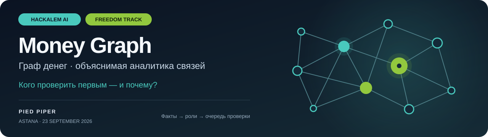

<p align="center">
  
</p>

<h1 align="center">Money Graph · Граф денег</h1>

<p align="center">
  <strong>HackAlem AI · Трек Freedom · Команда Pied Piper</strong><br>
  Объяснимая аналитика денежных потоков — от переводов до очереди ручной проверки.
</p>

<p align="center">
  <a href="https://www.hackalem.ai/"></a>
  
  
  
  
</p>

<p align="center">
  <a href="#локальный-запуск"><strong>Запустить</strong></a> ·
  <a href="docs/methodology.md">Методология</a> ·
  <a href="docs/demo.md">Демо для жюри</a> ·
  <a href="docs/backend.md">Backend / API</a> ·
  <a href="docs/README.md">Вся документация</a>
</p>

| Данные | Аналитика | Результат |
| :--- | :--- | :--- |
| **2 248** клиентов · **3 119** связей | **6** объяснимых ролей · **105** сообществ | **Top-20** для проверки · **3 CSV** |

> **Кейс трека Freedom:** восстановление финансовой структуры по графу переводов. Разработано на [HackAlem AI](https://www.hackalem.ai/), Астана, 23 сентября 2026.

<details>
<summary>Организаторы и партнёры HackAlem AI</summary>

Среди организаторов и партнёров мероприятия на [официальном сайте HackAlem AI](https://www.hackalem.ai/) указаны Astana Hub, Silkroad Innovation Hub, OpenAI и BAITC.

<p>
  <a href="https://www.hackalem.ai/"></a>
  <a href="https://www.hackalem.ai/"></a>
  <a href="https://www.hackalem.ai/"></a>
  <a href="https://www.hackalem.ai/"></a>
</p>

</details>


---

Локальный инструмент объяснимой AML-аналитики графа переводов команды Pied Piper.
Роли и приоритеты — сигналы для ручной проверки, а не доказательства нарушения.

## Эксперимент устойчивости сети

В **«Сеть и сообщества» → «Устойчивость сети: исключение ключевых узлов»** можно
исключить top-1/3/5/10 клиентов по приоритету и сравнить результат с отбором по обороту.
Показаны размер крупнейшей группы, новые изоляты, доля разобщённых пар оставшихся
клиентов, затронутые суммы и списки gid. Расчёт использует полную сеть независимо от
фильтров, не меняет роли и CSV. Это симуляция наблюдаемого графа, не рекомендация
блокировки и не оценка предотвращённого ущерба. [Метод и ограничения](docs/methodology.md#устойчивость-сети-what-if).

## Структура

```text
backend/             API, worker, pipeline и независимый validator
  core/              загрузка, контракты, графовая аналитика, экспорт и чтение результатов
frontend/            Streamlit, визуализация графа и HTML-шаблон
docs/                архитектура, методология, контракты и отчёты аудита
tests/               аналитические, API, UI и интеграционные проверки
scripts/             служебные команды запуска и проверки
data/                локальные исходные Parquet (не входят в Git)
outputs/             локальные результаты расчёта (не входят в Git)
.streamlit/          настройки Streamlit для запуска из корня проекта
Dockerfile           общий runtime-образ и отдельная стадия tests
compose.yaml         UI, подготовка результатов, API, worker и CLI
requirements.lock    закреплённые зависимости общего Python-окружения
```

Все команды выполняются из корня репозитория. Используется Python 3.12.
UI читает опубликованные файлы напрямую; API и worker работают отдельным сервисом.

## Локальный запуск

Windows PowerShell (нужен `uv`):

```powershell
.\make.cmd setup
.\make.cmd demo
```

Синтетический демонабор создаётся локально и не требует исходных данных.
Для расчёта предоставленного набора разместите `nodes.parquet`, `edges.parquet`
и `transactions.parquet` в `data/`, затем:

```powershell
.\make.cmd run
```

Linux/macOS: `make setup`, затем `make demo` или `make run`.
Интерфейс: http://localhost:3000. Для существующих результатов — `make ui` / `.\make.cmd ui`.
API и worker: `make backend` / `.\make.cmd backend` (порт 8000).

Прямые команды после активации окружения:

```bash
python -m backend.pipeline --data data --out outputs
python -m backend.validate --data data --out outputs
python -m streamlit run frontend/app.py --server.port 3000 -- --outputs outputs
python -m backend
python -m pytest -q
```

## Docker

Для UI нужны три входных Parquet в `data/`:

```bash
docker compose build ui
docker compose up -d --no-build --pull never
```

`prepare` рассчитывает результаты в именованном volume `results` либо проверяет
существующую публикацию. `ui` запускается после успешной проверки на http://localhost:3000.

```bash
docker compose run --rm validate
docker compose run --rm --no-deps pipeline
docker compose --profile backend up -d api worker
docker compose build tests
docker compose run --rm tests
docker compose down
```

API доступен на http://localhost:8000. API/worker используют отдельный volume
`backend-state`, UI — `results`. Локальный `outputs/` не является Docker volume.
Остановка через `down` сохраняет volumes. Данные и результаты не включаются в образ.

## Аудит и документация

- [Навигация по документации](docs/README.md)
- [Подробное руководство](docs/product-guide.md)
- [Методология](docs/methodology.md) и [архитектура](docs/architecture.md)
- [Backend API и ограничения](docs/backend.md)
- [Воспроизводимые проверки](docs/qa.md)
- [Схема исходных данных](data/README.md)

Исходные данные, результаты, окружения, runtime и кэши исключены из Git.
На чистом клоне исходные данные предоставляются отдельно; тесты реальных данных
требуют локального набора. Исторические отчёты описывают проверки указанных в них
версий и не заменяют новый прогон. Ранее закоммиченные данные остаются в истории Git.
