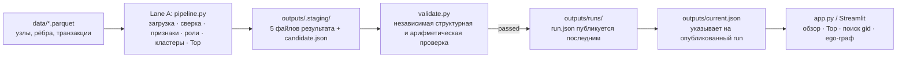

# Архитектура Money Graph

## Поток данных

Pipeline является единственным владельцем вычислений. Validator проверяет опубликованный результат, но не пересчитывает PageRank, betweenness или роли. UI читает только целый опубликованный bundle и не обращается к `data/`.

## Границы ответственности

| Контур | Ответственность | Доказательство готовности |
| --- | --- | --- |
| Lane A | parquet → признаки → роли/кластеры/Top → публикация | один завершённый bundle и `run.json` |
| Lane B | контракт, validator, read-only UI | validator pass, тесты и UI на bundle |
| Product / QA | воспроизводимость, фактические числа, сценарий и корректный язык | QA-протокол и пятиминутное демо |

## Публикация и целостность

1. Pipeline записывает пять файлов результата в staging-каталог с новым UUID.
2. Создаётся `candidate.json`; validator проверяет staging без записи и без публикации.
3. После успешной проверки pipeline фиксирует runtime, записывает `run.json`, перемещает каталог в `runs/<run_id>` и атомарно обновляет `current.json`.
4. UI сверяет manifest, SHA-256 и контракт. Ошибка означает сообщение о несовместимом/незавершённом расчёте, а не показ старых данных.

## Что видит аналитик

`nodes_roles.csv` даёт роль, кластер, приоритет и краткое evidence каждого клиента. `top_nodes.csv` добавляет ранг и «почему» для очереди проверки. `clusters.csv` описывает масштаб и внутренние потоки кластеров. Карточка в UI связывает эти данные с полными входящими и исходящими рёбрами.

Стрелка всегда означает наблюдаемый перевод `src → dst`. Граф и карточка явно показывают границу `depth=4`, seed и усечение визуализации.

## Ограничения интерпретации

Набор охватывает только исходящие ветви от 81 seed, максимум четыре поколения и переводы не менее 5 000 KZT. Поэтому «terminal», баланс потока или отсутствие связи трактуются только как наблюдаемые признаки. Выгрузка задаёт порядок ручной проверки, а не вывод о противоправности.
