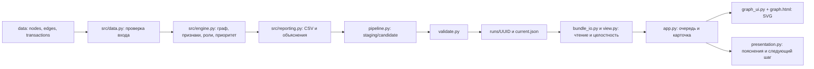

# Архитектура Money Graph

Рабочая реализация — пакетный Python pipeline и read-only Streamlit UI. HTTP API из [frontend-контракта](frontend-contract.md) пока не реализован.

## Компоненты

`src/contracts.py` задаёт общие схемы v1.0.0. UI и validator не вызывают engine. Plotly-представления в `src/view.py` сохранены: модуль и его функции используются в существующих проверках; основной экран использует SVG/JavaScript.

## Публикация

1. Pipeline читает и сверяет вход, рассчитывает результат.
2. Записывает три CSV и два Parquet в новый staging-каталог с UUID.
3. Candidate проверяется независимым процессом validator. Ошибка или total ≥300 с останавливают публикацию.
4. Создаётся run.json, каталог переносится в runs/, current.json заменяется атомарно. Старые запуски сохраняются.
5. UI разрешает current.json и проверяет bundle. Поля и SHA256 защищают от смешения запусков; при ошибке нет неявного отката.

Manifest содержит SHA256 исходных и выходных файлов, версии, counts, веса, нормализацию, пороги, времена и результат проверки. Сам manifest не является подписанным доказательством качества классификации.

## Интерфейс

Главный экран «Проверка клиентов» соединяет очередь, разбор роли, исходный evidence, вклады приоритета и направленные связи. «Сеть и сообщества» показывает структуру сети. Прямые таблицы связей полны, даже если граф усечён.

По умолчанию ego показывает до 40 узлов; предел можно увеличить до 100. В одном графе не более 350 рёбер, в обзоре — до 100 сообществ. Ручная раскладка не меняет результаты и может сбрасываться после смены параметров.

## Docker и локальное окружение

Локальные результаты находятся в outputs/. В Docker сервис prepare создаёт или проверяет публикацию в volume money-graph_results, затем запускается ui. Исходный data/ монтируется read-only, UI получает read-only volume результатов. Внешний порт — 127.0.0.1:3000; внутренний Streamlit-порт — 8501.

UI не обращается к внешним API/CDN. Для установки/сборки нужны источники пакетов и образов. Проверки и диаграмма относятся к текущему коду; исторические замеры — в [индексе документов](README.md).
