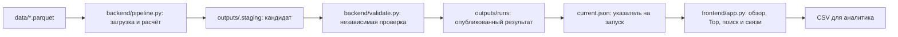

# Money Graph — объяснимая аналитика денежных потоков

Проект команды **Pied Piper** для AML-аналитика: помогает ответить на вопрос **«кого проверить первым и почему?»** по графу внутрибанковских переводов.

Вместо ручного просмотра всех связей аналитик получает очередь Top-20, графовую роль каждого клиента, сообщества и конкретные факты о входящих и исходящих потоках. Решение работает локально. Роли и баллы — гипотезы для ручной проверки, а не доказательство нарушения или вероятность виновности.

## Что реализовано

- Backend API и отдельный worker: [запуск, хранение и ограничения](backend.md).
  Импорт hackathon-v1, управление расчётами, аналитика, сохранённый выбор и CSV.
  Новый frontend не реализован; существующий Streamlit не переводился на API.

- Полный расчёт из трёх Parquet-файлов одной командой: проверка входа, графовые признаки, роли, кластеры, приоритеты и экспорт.
- Шесть ролей с числовой поддержкой правилами, альтернативной ролью и объяснением `evidence`. Evidence содержит факты и порог допуска из текущего расчёта; карточка «Почему назначена эта роль» раскрывает условия и ближайшую альтернативу.
- Очередь Top-20 с `why`: факты и два крупнейших вклада в приоритет.
- Разбиение на слабые компоненты связности и сообщества; изолированные клиенты сохраняются.
- Streamlit-интерфейс: обзор сети, поиск точного `gid`, фильтры по роли, кластеру, компоненте и приоритету.
- Граф окружения клиента на 1–2 шага со стрелками, окраской по роли или кластеру; полные таблицы прямых входящих и исходящих связей.
- Карточка клиента с метриками, вкладами в приоритет и предупреждениями о неполноте данных.
- Скачивание трёх CSV из интерфейса.
- Независимый validator: схемы, покрытие клиентов, согласованность таблиц, арифметика и SHA256.
- Публикация версионированных результатов, локальный запуск, Docker Compose и синтетический пример для тренировки.

### Значение ролей

| Роль | Наблюдаемый паттерн |
| --- | --- |
| `consolidator` | Приём средств от нескольких отправителей |
| `distributor` | Отправка средств нескольким получателям |
| `transit` | Сходство наблюдаемых входящего и исходящего объёмов |
| `terminal` | Значимый входящий поток при отсутствии наблюдаемых исходящих связей, вне границы обхода |
| `coordinator` | Структурное посредничество и соединение ветвей графа |
| `peripheral` | Нет допустимой содержательной роли по текущим правилам |

`peripheral` не означает безопасность клиента, а `coordinator` не устанавливает фактическое руководство группой.

## Как работает решение

Backend запускается командой `python -m backend` из окружения проекта
(Windows: `.\.venv\Scripts\python.exe -m backend`), API: `http://127.0.0.1:8000`.
Docker: `docker compose --profile backend up -d --build api worker`.
[Контракт API](frontend-contract.md); машинная схема сервера: `/openapi.json`.
Ниже описан сохранённый сценарий CLI/Streamlit.

1. Входные таблицы из `data/` проверяются по типам, идентификаторам, датам и суммам. Агрегаты транзакций сверяются с рёбрами.
2. На направленном графе считаются контрагенты, объёмы, количества переводов, PageRank, приближённое посредничество (betweenness), расстояние от seed и межкластерные связи.
3. Алгоритм Louvain выделяет сообщества на ненаправленной взвешенной проекции. Правила определяют допустимые роли, основную роль и приоритет проверки.
4. Результат записывается во временный каталог, проходит независимую валидацию и публикуется как единый набор файлов — bundle.
5. Аналитик выбирает клиента из очереди или вводит любой `gid`, изучает объяснение и направления переводов; обзор доступен в разделе «Сеть и сообщества», CSV — в блоке скачивания.

### Как считается приоритет

Приоритет отделён от роли и складывается из четырёх компонентов:

| Компонент | Вес | Смысл |
| --- | ---: | --- |
| Структура | 0,35 | Посредничество, PageRank и связи между кластерами |
| Близость к seed | 0,20 | Расстояние по исходящим шагам от исходных клиентов |
| Масштаб потоков | 0,30 | Наблюдаемый входящий плюс исходящий оборот |
| Поддержка ролью | 0,15 | Итоговый балл роли; для peripheral вклад равен нулю |

Числовые признаки нормируются через `log1p` и 95-й процентиль положительных значений с ограничением [0, 1]. Пороги ролей вычисляются из данных; значения порогов, масштабов и весов записываются в `run.json`. Веса являются эвристикой, а не обученной моделью. Полные допуски, формулы и разрешение неоднозначности описаны в [методологии](methodology.md); реализация — [backend/core/engine.py](../backend/core/engine.py), контракт — [backend/core/contracts.py](../backend/core/contracts.py).

В проверенном официальном результате минимумы: 2 отправителя для consolidator, 3 получателя для distributor, вход 166 819,70 KZT для terminal. Transit требует пригодного баланса min(r,1/r) ≥0,591789; coordinator — положительного betweenness ≥0,0000882113 и дополнительных связей между ветвями. Это вычисленные пороги, не фиксированные константы.

## Технологии

| Технология | Назначение |
| --- | --- |
| Python | Расчёт, проверки и приложение; локальная установка через make использует Python 3.12 |
| pandas 2.2.3, NumPy 2.2.6 | Табличные данные и числовые расчёты |
| PyArrow 19.0.1 | Чтение и запись Parquet |
| NetworkX 3.4.2, SciPy 1.15.3 | Графовые алгоритмы и численные зависимости |
| Streamlit 1.49.1, локальный SVG/JavaScript | Интерфейс, перетаскивание узлов и интерактивные графы |
| Plotly 6.3.0 | Вспомогательные графовые представления и их проверки |
| pytest 8.4.2, Streamlit AppTest | Автоматические проверки |
| FastAPI 0.141.1, Uvicorn 0.53.0, python-multipart 0.0.32 | Локальный HTTP API и загрузка файлов |
| SQLite (стандартная библиотека), HTTPX 0.28.1 | Реестр заданий и сохранённого выбора; HTTP-проверки |
| Docker, Docker Compose | Контейнерный запуск; образ на Python 3.12.12 |
| uv, GNU Make / make.cmd | Установка окружения и команды разработки |

Прямые зависимости перечислены в [requirements.txt](../requirements.txt), закреплённый набор — в [requirements.lock](../requirements.lock). В репозитории также есть отдельная браузерная smoke-проверка через Playwright; для неё нужна дополнительная установка Playwright/Chromium.

**AI-модели, LLM, внешние API и облачные аналитические сервисы не используются.** Объяснения формируются из рассчитанных метрик по шаблонам. Для установки зависимостей и сборки Docker нужен доступ к источникам пакетов/образов; основной расчёт и интерфейс работают локально. Телеметрия Streamlit отключена.

## Архитектура



| Компонент | Ответственность |
| --- | --- |
| `backend/core/data.py` | Загрузка и проверка исходных таблиц |
| `backend/core/engine.py` | Граф, сообщества, признаки, роли и приоритет |
| `backend/core/reporting.py` | Таблицы результатов и текстовые объяснения |
| `backend/core/contracts.py` | Схемы v1.0.0, типы, роли, веса и допуски |
| `backend/pipeline.py` | Последовательность расчёта, проверка и публикация |
| `backend/validate.py` | Проверка результата независимо от engine |
| `backend/core/bundle_io.py`, `frontend/view.py` | Чтение публикации, проверка целостности и построение графиков |
| `backend/core/results.py` | Чтение и проверка bundle для backend и validator без визуализации |
| `backend/api.py`, `backend/store.py`, `backend/worker.py` | HTTP API, SQLite-реестр и отдельный обработчик заданий |
| `frontend/graph_ui.py`, `frontend/graph.html` | Интерактивный SVG-граф, перетаскивание узлов и компактная раскладка |
| `frontend/presentation.py` | Понятные пояснения к рассчитанным ролям и приоритетам |
| `frontend/app.py` | Рабочее место аналитика |
| `scripts/ensure_results.py` | Подготовка или проверка результата при Docker-запуске |
| `scripts/audit_evidence.py` | Отдельный read-only QA текста evidence/why по исходным данным |

Завершённый запуск содержит три CSV, два Parquet и `run.json`. Pipeline публикует manifest после успешной проверки и атомарно обновляет `current.json`. UI читает один опубликованный запуск, не пересчитывает роли и не использует исходный каталог `data/`.

```text
outputs/
  current.json
  runs/<run_id>/
    run.json
    nodes_roles.csv
    clusters.csv
    top_nodes.csv
    node_metrics.parquet
    edges.parquet
```

В `run.json` сохраняются версии, SHA256 входных и выходных файлов, размеры набора, seed алгоритмов, пороги, веса, длительности этапов и статус проверки.

## Установка и запуск

Клонируйте репозиторий и перейдите в его корень. Для приватного репозитория нужен доступ к нему:

```bash
git clone https://github.com/BAITC-Hacks/hack-4c401bd7-pied-piper.git
cd hack-4c401bd7-pied-piper
```

Исходные Parquet предоставляются отдельно: поместите их в `data/`. Результаты создаются локально командой pipeline; данные и результаты исключены из Git. Выберите один вариант запуска: Docker или локальное Python-окружение. Оба по умолчанию используют **http://localhost:3000**.

### Вариант 1. Docker — Windows, Linux, macOS

Нужен Docker с Compose и Linux-контейнерами; на Windows подходит Docker Desktop.

```bash
docker compose build ui
docker compose up -d --no-build --pull never
```

Откройте **http://localhost:3000**. При первом запуске сервис `prepare` рассчитает результат в Docker volume. При последующих запусках он проверит сохранённый результат; интерфейс запустится после успешной проверки.

Проверка состояния и данных:

```bash
docker compose ps
docker compose logs prepare
docker compose run --rm validate
```

После изменения входных данных или аналитического кода выполните явный пересчёт; после изменения кода сначала пересоберите образ:

```bash
docker compose build ui
docker compose run --rm --no-deps pipeline
docker compose up -d --no-build --pull never
```

Остановка:

```bash
docker compose down
```

Результаты сохраняются в volume `money-graph_results`, отдельно от локальной папки `outputs/`. Каталог `data/` и результаты для UI подключаются только для чтения. Добавление `-v` к команде остановки удалит volume с результатами.

### Вариант 2. Windows — CMD или PowerShell

Нужен установленный `uv`, доступный в терминале. GNU Make не требуется.

Из корня проекта выполните:

```powershell
.\make.cmd setup
.\make.cmd run
```

`setup` создаёт `.venv` с Python 3.12, если окружения ещё нет, и устанавливает зависимости. `run` рассчитывает **реальные данные**, проверяет результат и открывает сервер на порту 3000. При ошибке следующий шаг не выполняется.

### Вариант 3. Linux / macOS

При установленных `uv` и GNU Make:

```bash
make setup
make run
```

Без GNU Make:

```bash
uv venv --python 3.12 .venv
uv pip sync --python .venv/bin/python requirements.lock
.venv/bin/python -m backend.pipeline --data data --out outputs
.venv/bin/python -m backend.validate --data data --out outputs
.venv/bin/python -m streamlit run frontend/app.py --server.address 127.0.0.1 --server.port 3000 -- --outputs outputs
```

### Полезные команды

В Windows замените `make` на `.\make.cmd`.

| Команда | Действие |
| --- | --- |
| `make pipeline` | Пересчитать данные и опубликовать результат |
| `make validate` | Проверить результат и его соответствие исходным данным |
| `make ui` | Открыть существующий результат без пересчёта |
| `make stop` | Остановить локальный UI проекта на выбранном порту |
| `make test` | Запустить pytest |
| `make demo` | Создать и открыть отдельный синтетический пример из 24 клиентов |
| `make help` | Показать все команды, включая Docker |

Локальный сервер можно остановить через Ctrl+C в его терминале. Для другого порта: `make ui PORT=3001`; в PowerShell — `$env:PORT = "3001"`, затем `.\make.cmd ui`. Пути `DATA` и `OUTPUTS` также настраиваются через параметры Make или переменные окружения для `make.cmd`.

Если validator сообщает о несовпадении SHA256, выполните пересчёт через `make run` / `.\make.cmd run`. Ранее на Windows обнаруживалась замена LF на CRLF в CSV; текущий [.gitattributes](../.gitattributes) защищает опубликованные файлы от такого преобразования при checkout. Подробности — в [отчёте об ошибке SHA256](audit-sha256-20260923.md).

## Как проверить решение: сценарий для жюри

1. Запустите проект одним из способов выше и откройте **http://localhost:3000**.
2. В разделе «Сеть и сообщества» проверьте **2 248 клиентов, 105 сообществ и 35 компонент**. Число связей (**3 119**) указано в боковом блоке «О данных и ограничениях».
3. Откройте «Проверка клиентов» и нажмите одного из первых клиентов в очереди. Прочитайте смысл роли и блок «Почему стоит посмотреть».
4. Вставьте `gid` в поиск. Сверьте роль, evidence и входящий/исходящий объёмы с таблицами связей. Стрелка означает **плательщик → получатель**.
5. Посмотрите четыре вклада в приоритет и раскрываемую таблицу всех признаков. Поиск работает по всему набору, даже если клиент скрыт фильтрами.
6. Проверьте три конкретных случая из [семантического QA](qa-real-data.md):

| gid | Что проверить |
| --- | --- |
| `100000003684369100` | Distributor, 62 получателя; предупреждение о неполном входящем потоке seed |
| `100000006381453100` | Узел depth=4; предупреждение о неизвестном продолжении потока |
| `100000005017150100` | Изолированный seed, нулевые входящие и исходящие связи |

7. Внизу страницы раскройте «Скачать результаты и проверить данные» и скачайте `top_nodes.csv`, `nodes_roles.csv` и `clusters.csv`. Проверьте, что роли покрывают 2 248 клиентов, а Top содержит 20 строк.
8. Запустите независимую проверку: `make validate` / `.\make.cmd validate` или, при Docker-запуске, `docker compose run --rm validate`. Ожидаемый статус — `passed`.

После улучшения evidence: **117 passed за 53,32 с** на Linux / Python 3.12; независимый аудит всех 2 248 клиентов прошёл. Пересчёт занял 1,90 с. В обновлённом Docker проверены объяснения всех шести ролей, поиск и скачивание трёх CSV; их SHA256 совпадают с локальной публикацией. Роли, оценки и графовые признаки при изменении текстов сохранены.

Для запуска автоматических тестов используйте `make test` / `.\make.cmd test`. В Docker тесты имеют отдельный образ:

```bash
docker compose build tests
docker compose run --rm tests
```

Проверки охватывают аналитику, обновлённый UI, backend и аудит evidence: шесть ролей и объяснения, ограничения для seed и depth=4, пороги и конкурирующие роли, изоляты, Top, кластеры, runtime <300 секунд, интерактивные графы, API, импорт, очередь, восстановление worker и обнаружение искажённых evidence/why.

После объединения backend с очисткой репозитория и аудитом evidence: **115 passed за 53,10 с** на Windows / Python 3.12. Единственное предупреждение — об устаревании HTTPX-адаптера Starlette TestClient. Validator и аудит текущего официального результата также прошли. Docker и браузер в этом проходе заново не проверялись.

Для отдельного запуска аналитических проверок в Windows:

```powershell
.\.venv\Scripts\python.exe -m pytest -q tests/test_role_semantics.py tests/test_a_verification.py
```

Для проверки всех текстов на реальном результате:

```powershell
.\.venv\Scripts\python.exe scripts/audit_evidence.py --data data --out outputs
```

Аудит текущей публикации: 2 248 evidence и 20 why, несовпадений фактов не найдено; длина 88–145 символов (лимит 200). Скрипт только читает файлы. Смысловые ограничения и предложения улучшения — в [отчёте](evidence-audit.md).

До текущего merge в ветке backend зафиксирован полный набор **111 passed** на Windows (70,65 с) и в Docker Linux (91,90 с), без четырёх тестов аудита evidence. Последующие изменения панели Streamlit дополнительно проверены шестью UI/graph-тестами в обеих средах. Ранее также выполнен сквозной HTTP-сценарий backend на официальных данных. Источники: [проверка backend](backend-verification.md), [проверки UI](TECHNICAL_LANE_B.md), [аудит аналитики](AUDIT_LANE_A.md), [семантический QA](qa-real-data.md), [проверки исходного CLI/Docker](audit-sha256-20260923.md). Эти проверки подтверждают согласованность реализации, но не точность обнаружения нарушений.

Pipeline отклоняет публикацию, если измеренное время от начала чтения до завершения проверки кандидата достигает 300 секунд. Фактическое время конкретного запуска находится в `run.json → stage_runtimes_seconds`; оно не включает установку, сборку Docker и запуск UI.

## Как пользоваться

В разделе **«Проверка клиентов»** слева показана очередь по приоритету. Нажмите клиента: справа появятся место в очереди, смысл роли, факты, главные вклады в приоритет и подсказка «Что проверить дальше». Приоритет показан из 100 для удобства; в CSV остаётся исходное значение от 0 до 1. Поддержка роли — отдельный показатель от 0 до 1, не вероятность нарушения.

Граф и полные входящие/исходящие переводы находятся ниже карточки. Поиск по полному gid в боковой панели открывает любого клиента независимо от фильтров. Сложные признаки и альтернативная роль доступны в раскрывающемся блоке, выгрузки и manifest — в блоке «Скачать результаты и проверить данные» внизу.

В разделе **«Сеть и сообщества»** виден общий граф и сводка групп. Одиночные и несвязанные компоненты компактно расположены вокруг основной сети; близость на экране не является финансовой связью.

## Работа с графом

Узлы в обоих графах можно перетаскивать мышью; колесо меняет масштаб, перетаскивание фона перемещает холст. В разборе клиента режим «По потокам» размещает отправителей слева, получателей справа, связи в обе стороны сверху. «Свободно» показывает сетевую раскладку. «Вписать» возвращает все узлы в кадр, «Сбросить» отменяет ручную расстановку.

Клик по узлу подсвечивает его связи. «Только связи выбранного» скрывает остальные линии, «Подписи» показывает короткие метки. Полный gid доступен под графом: скопируйте его в поиск для открытия карточки другого клиента. По умолчанию показано до 40 узлов; переключатель над графом позволяет выбрать 20/40/60/100. Скрытые узлы/рёбра подсчитываются; таблицы прямых связей остаются полными.

Перетаскивание не меняет роли, приоритет или CSV. Расстановка сбрасывается при пересоздании графа, например при смене клиента или фильтров. Граф работает локально без CDN и внешних API.

## Данные и интеграции

Источник — предоставленный для задачи набор внутрибанковских переводов, описанный в [data/README.md](../data/README.md).

| Файл | Содержимое |
| --- | --- |
| `data/nodes.parquet` | 2 248 клиентов: `gid`, глубина появления `depth`, флаг `is_seed` |
| `data/edges.parquet` | 3 119 направленных пар: отправитель, получатель, сумма KZT, число переводов и глубина обнаружения |
| `data/transactions.parquet` | 4 840 отдельных переводов: отправитель, получатель, календарная дата и сумма |

Период — **1–31 июля 2026 года**. Обход начинается от **81 seed-клиента**, идёт только по исходящим переводам, ограничен четырьмя шагами и суммой **от 5 000 KZT**.

Идентификаторы хранятся как signed int64; для отображения передаются строками, чтобы не потерять точность. Совпадающие строки транзакций сохраняются: transaction ID отсутствует, поэтому совпадение не доказывает ошибочный дубль.

Аналитический обмен использует Parquet/CSV/JSON; новый локальный backend предоставляет HTTP API для импорта, расчётов, аналитики и сохранения выбора. Подключений к банковским системам, внешним API или потокам событий нет. Импорт hackathon-v1 ограничен официальными файлами; новый frontend пока не подключён.

## Ограничения

- Выборка неполная: входящие связи seed и продолжение графа за depth=4 неизвестны, переводы ниже порога отсутствуют. Наблюдаемые суммы не являются балансами счетов.
- Seed исключаются из роли transit; узлы depth=4 — из terminal. Отсутствие исходящих связей на границе не доказывает завершение движения денег.
- Transit описывает сходство объёмов; временное прослеживание происхождения средств и доказательство быстрого транзита не реализованы. Даты имеют точность до дня.
- Нет независимой разметки истинных ролей или нарушений; accuracy, F1 и полнота выявления не измерены. Роли, пороги и сообщества чувствительны к методологическим настройкам.
- Validator проверяет структуру и арифметическую согласованность, но не пересчитывает PageRank/betweenness и не доказывает содержательную корректность каждой роли.
- Интерфейс ограничивает обзор 100 сообществами, окружение — 100 узлами, отображение графа — 350 рёбрами. Усечение обозначается; таблицы прямых связей остаются полными.
- Обработка выполняется пакетно в памяти. Поддержка миллиона узлов, потоковой обработки и промышленного многопользовательского развёртывания не подтверждена.
- Загрузчик ориентирован на контракт этой задачи: июль 2026, порог 5 000 KZT и по умолчанию 2 248 узлов. Произвольный банковский набор потребует адаптации; уменьшенный `--expected-nodes` используется для явно помеченных синтетических данных.

## Развёрнутая версия

**Подтверждённая ссылка на публично развёрнутую версию в репозитории не указана.** После локального запуска приложение доступно по адресу **http://localhost:3000**. Это адрес на компьютере пользователя, а не публичный сервис.

## Дополнительные материалы

- [Навигация по документации и состав очистки](README.md)
- [Оценка качества evidence и воспроизводимый аудит](evidence-audit.md)
- [Методология и план масштабирования до 1 млн узлов](methodology.md)
- [Сценарий пятиминутного демо](demo.md)
- [QA-чеклист](qa.md)
- [Архитектура и протокол публикации](architecture.md)
- [Технические команды UI и validator](TECHNICAL_LANE_B.md)
- [Актуальный чеклист сдачи](PLAN.md)
- [Контракт API и будущего frontend](frontend-contract.md)
